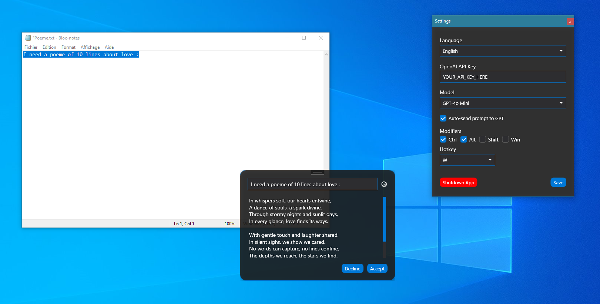

# ✨ WinPilot — Your Context-Aware AI Copilot for Windows


---

## 🧠 What is WinPilot?

> _Ever wish GPT could just pop in and finish your thoughts... before you even ask?_  
> No more alt-tab. No more copy-paste.  
> **WinPilot** is your universal AI assistant that works in **any Windows app**, triggered by a simple **keyboard shortcut**.

It reads your current context — active app, window title, selected text, focused content, even a screenshot — and gives you exactly what you were about to type.

Like **Copilot**, but **everywhere**.

---

## 💡 Features

- ✅ Global **hotkey trigger** (configurable)  
- ✅ Automatically reads your screen & text context  
- ✅ Takes a screenshot of the active window  
- ✅ Sends everything to OpenAI (GPT-4 vision)  
- ✅ Shows a beautiful animated suggestion window  
- ✅ 1-click “Accept” → auto-pastes into the app you were using  
- ✅ Full WPF + MVVM + .NET 8  
- ✅ **ResX localized** (English + Français + Español + Deutsch)  
- ✅ ❤️ Designed with love and keyboard nerd energy

---

## 🖼️ Screenshot

> _“Cooking something...”_



---

## 🛠 How it works

1. You press `Ctrl + Alt + W` (or your own shortcut)  
2. WinPilot captures:
   - App name
   - Window title
   - Focused control
   - Selected text (via Ctrl+C)
   - Screenshot of the active window  
3. It builds a prompt like:

```
The user is currently in SQL Server. The selected text is: "SELECT * FROM Client". The window title is "SSMS - Query.sql". The user wrote in the editor: "-- I want to add a new column for the phone number."
```

4. GPT gets that context and replies:

```sql
ALTER TABLE Client ADD Phone VARCHAR(50);
```

5. You accept it, and boom 💥 it gets pasted into your app. Zero effort.

---

## ⚙️ Settings

You can configure:

- Your OpenAI API key (stored locally)
- The GPT model (with image support)
- Auto-send on hotkey
- Your preferred shortcut keys

---

## 🔐 Privacy

🧠 All context is kept locally except when explicitly sent to OpenAI.  
You can choose to disable auto-send.

---

## 🔧 Built With

- WPF (.NET 8)
- MVVM (almost zero code-behind)
- Custom Hotkey manager with Win32
- ResX resources (EN/FR/ES/DE)
- Love and stubbornness

---

## 📥 Installation

> _For now: clone + build in Visual Studio (Release mode)_  
> .EXE version & installer coming soon™

---

## 👨‍💻 About the author

**Damien Villeneuve (aka BlinkSun)**  
Dad. Dev. Dreamer.  
[blinksun.ca](https://www.blinksun.ca)

---

## 📄 License

MIT — Free to use, remix, improve, and star ⭐  
Just don't call it "Copilot" or Microsoft might... pilot your repo into oblivion 😅

---

## ⭐ If you like it...

Don’t be shy — click that ⭐️ !  
WinPilot loves attention.